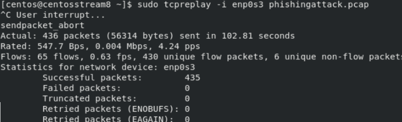
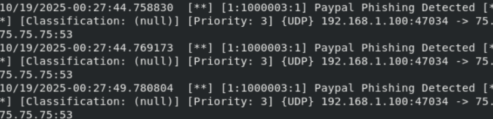

# Suricata IDS/IPS 

   Ce projet présente la mise en place et l'exploitation de **Suricata**, un système de détection et de prévention d'intrusions (IDS/IPS), dans un environnement CentOS 8.


# Suricata IDS – Partie 1 : Installation, Configuration et Tests

##  Objectifs
- Installer et configurer Suricata en mode IDS.
- Tester la détection de trafic malveillant via des règles personnalisées et existantes.
- Analyser un fichier PCAP pour identifier des attaques de phishing.

## Étapes principales

### 1. Installation et configuration de Suricata
- Ajout des dépôts OISF et installation des dépendances.
- Configuration des variables réseau (`HOME_NET`, `EXTERNAL_NET`).
- Désactivation de l'offloading (LRO/GRO) pour une capture fiable.
- Mise à jour des règles avec `suricata-update`.

### 2. Test des règles existantes
- Vérification du chargement des règles (plus de 61 000 règles).
- Génération d'alerte via un User-Agent suspect (`BlackSun`).
- Détection d'une attaque SYN Flood avec `hping3`.

### 3. Création de règles personnalisées
- Ajout d'une règle pour détecter les pings ICMP.
- Création d'une règle pour identifier les tentatives de phishing PayPal via DNS.

### 4. Analyse de PCAP et rejeu de trafic
- Téléchargement et analyse d'un fichier `phishingattack.pcap` avec Wireshark.
- Rejeu du trafic avec `tcpreplay` et validation des alertes Suricata.

## Commandes clés
```bash
sudo suricata -c /etc/suricata/suricata.yaml -v -i enp0s3
sudo suricata-update
sudo tail -f /var/log/suricata/fast.log
```

## Fichiers de configuration modifiés
- `/etc/suricata/suricata.yaml`
- `/etc/sysconfig/suricata`
- `/var/lib/suricata/rules/custom.rules`

## Tests et Validation

### 1. Signature Personnalisée
Pour détecter l'attaque de phishing, j'ai ajouté la règle suivante dans `custom.rules` :

### 2. Exécution du test
Le trafic a été simulé en rejouant un fichier PCAP :
```bash
sudo tcpreplay -i enp0s3 phishingattack.pcap
```



### 3. Analyse des Logs
Les alertes générées par Suricata confirment la détection de l'anomalie :



## Résultats
- Suricata fonctionne en mode IDS avec des règles personnalisées et tierces.
- Détection réussie d'attaques : User-Agent suspect, SYN Flood, phishing DNS, et ICMP.


-------------------------------------------------------------------------------------------------------------------


# Suricata IPS – Partie 2 : Configuration et Tests en Mode Prévention


## Objectifs
- Configurer Suricata en mode IPS (Intrusion Prevention System) avec NFQUEUE
- Implémenter des règles de blocage proactif du trafic malveillant
- Analyser le trafic TLS et extraire les fichiers téléchargés
- Traiter les alertes au format JSON pour analyse avancée

## Configuration IPS
- Activation du mode NFQUEUE dans `suricata.yaml`
- Redirection du trafic iptables vers Suricata :
  ```bash
  iptables -A OUTPUT -j NFQUEUE
  iptables -A INPUT -j NFQUEUE
  ```

## Règles de blocage implémentées

### Blocage ICMP
```bash
drop icmp $HOME_NET any -> 8.8.8.8 any
```
**Résultat** : Ping vers 8.8.8.8 → 100% bloqué

### Filtrage HTTP
```bash
drop tcp $HOME_NET any -> $EXTERNAL_NET any
```
**Résultat** : Accès HTTP → Complètement bloqué

### Sécurité TLS
```bash
drop tls any any -> any any (tls_cert_expired;)
```
**Résultat** : Certificats expirés → Bloqués

### Blocage Facebook
```bash
drop tls any any -> any any (content:"facebook.com";)
```
**Résultat** : Accès à Facebook → Empêché

## Fonctionnalités avancées

### Extraction de fichiers
- Activation du stockage dans `suricata.yaml`
- Récupération des fichiers téléchargés via HTTP

### Analyse JSON
- Format EVE activé pour les logs
- Détection d'ETERNALBLUE dans PCAP WannaCry
- Analyse avec outils `jq`

## Commandes IPS
```bash
suricata -c /etc/suricata/suricata.yaml -q 0
```

## ✅ Résultats
- Mode prévention actif avec blocage en temps réel
- Protection contre multiples vecteurs d'attaque
- Analyse approfondie du trafic réseau
- Détection de malware avancé


